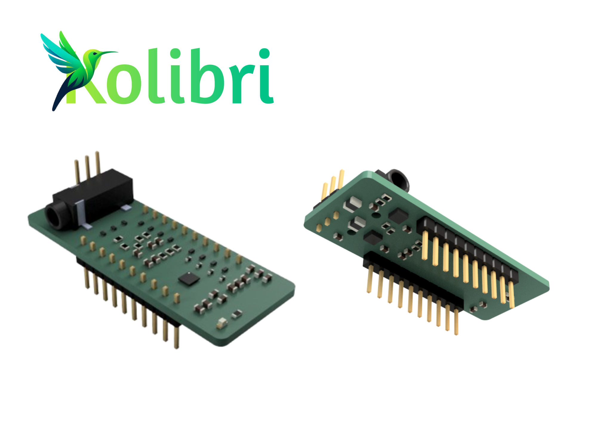
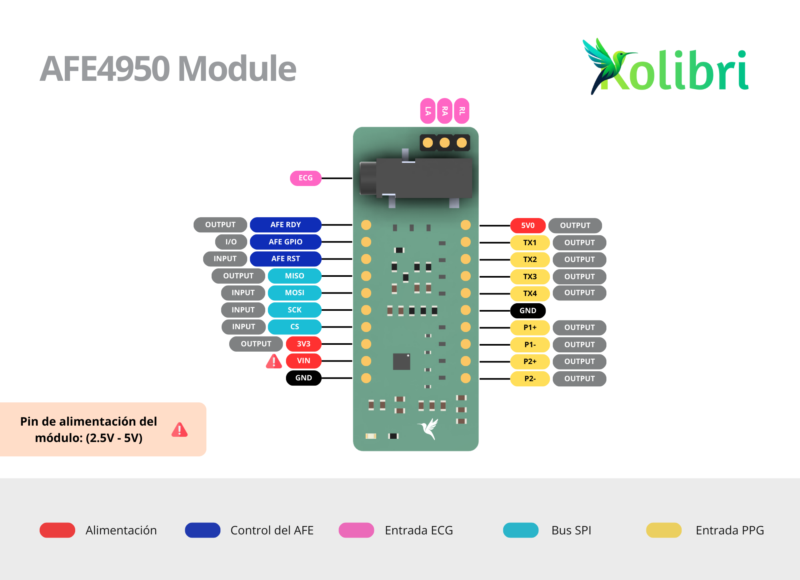

# AFE4950 Library for Arduino

An Arduino library designed to interface the Analog Front End (AFE) AFE4950 — an ultra-small, high-precision biomedical sensor — with ESP32, Nordic nRF52840, and compatible Arduino boards. This library simplifies the integration of the AFE4950 for real-time biosignal acquisition, specifically ECG and PPG signals, making it suitable for both prototyping and real-world applications.

## AFE4950 Module

The AFE4950 Module is a versatile development board specifically built to facilitate the usage of the AFE4950 for biomedical applications. It includes:

- **High-precision components** for reliable signal acquisition.
- **Electrostatic discharge (ESD) protection** to prevent damage from electrostatic events.
- **High-frequency noise filtering elements**, enhancing signal clarity and stability.

### Technical Specifications

- **High-precision components** to achieve accurate biosignal acquisition.
- **ESD protection** to safeguard circuits from electrostatic discharges, ensuring long-term reliability.
- **Noise filtration** to minimize high-frequency disturbances, making this module a reliable choice for both research and real-world projects.

> The AFE4950 Module is intended as a development board but is perfectly usable for direct integration into real projects.

  
  

## Features

- Simultaneous acquisition of single-channel ECG and PPG signals.
- Configurable sampling frequency.
- Adjustable FIFO settings, including watermark level, for efficient data handling.

## Getting Started

This library is compatible with ESP32 and similar microcontrollers. To begin using the AFE4950 in your project:

1. **Download the Library**  
   Search for library in Arduino library manager.

2. **Include the Library**  
   Add the following line at the top of your Arduino sketch:
   
   ```cpp
   #include <AFE4950.h>
   ```

3. **Connect the AFE4950 Module**  
   Follow the pinout diagram above to connect your AFE4950 Module to your microcontroller.

4. **Initialize and Configure**  
   Use the example provided to set up and begin data acquisition with the AFE4950.

## Requirements

- **Arduino IDE 1.8.13 or later**
- **PlatformIO** (optional, for advanced development)

## Documentation

Comprehensive documentation for each function and method is available in the `docs/api.md` file, with additional usage examples in the `examples` folder. 

For more information or questions, please contact us at: [jjlondonocarrillo@gmail.com](mailto:jjlondonocarrillo@gmail.com).
