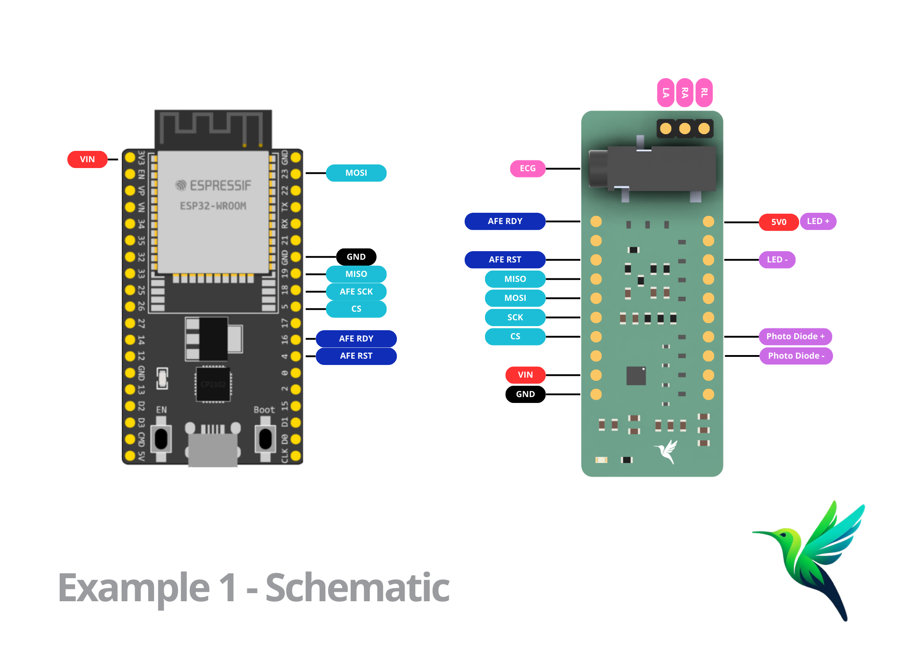
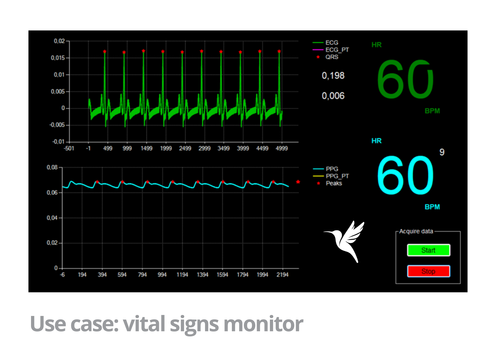

# AFE4950 ECG & PPG Acquisition Example

Acquire single-channel ECG and PPG signals simultaneously using the AFE4950 module and an ESP32 as the host microcontroller.

This example demonstrates how to configure the AFE4950 to capture ECG and PPG signals at a 500 Hz sampling rate, with the FIFO buffer set to trigger an interrupt when it holds 3 samples. The data sequence captured is structured as follows:
- ECG
- ECG
- PPG

The capture can be controlled using commands sent over Serial, with "start" to begin acquisition and "stop" to end it. The serial port is configured at 115200 baud.

## Hardware Required

* ESP32 microcontroller
* AFE4950 module
* ECG lead cables (for Jack connector or RA, LA, RL pins)
* PPG sensor
* Hook-up wires

## Circuit

### ECG Connections
1. **RA (Right Arm)**: Connect to pin RA on the AFE4950 module.
2. **LA (Left Arm)**: Connect to pin LA on the AFE4950 module.
3. **RL (Right Leg - ground/reference)**: Connect to pin RL on the AFE4950 module.

### PPG Sensor Connections
- **LED**:
  - **Anode**: Connect to the 5V pin on the ESP32.
  - **Cathode**: Connect to TX2 on the ESP32.
- **Photodiode**:
  - **Anode**: Connect to P1+ on the AFE4950.
  - **Cathode**: Connect to P1- on the AFE4950.

### Schematic

## Commands

| Command | Description        |
|---------|--------------------|
| `start` | Begins data capture |
| `stop`  | Ends data capture   |

## Code Explanation

This example initializes the AFE4950 in `configure` mode to set the correct sampling rate and FIFO interrupt settings. The code then listens for serial commands to control the start and stop of data acquisition. Data is captured in sequence and stored in a buffer, with the FIFO buffer triggering an interrupt each time it reaches the 3-sample watermark.

Data flow in this example is designed for sequential ECG and PPG acquisition, which you can visualize or process as needed.

## Example Use Case: Vital Signs Monitor

This library can be utilized as a foundation to build a comprehensive vital signs monitoring system. Using the AFE4950 and an ESP32, physiological signals like ECG and PPG can be acquired in real-time and transmitted to a computer for visualization and analysis.

In this example setup, the acquired signals are processed and displayed on a custom PC interface, providing real-time feedback on heart rate calculated from both PPG and ECG.

